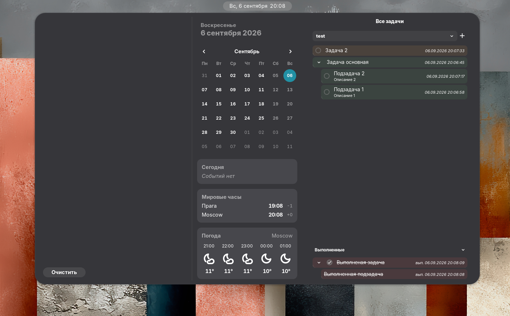

<div align="center">
  
</div>

# Google Tasks for Gnome


A Gnome shell extension to manage your [Google Tasks](https://tasks.google.com) directly from a notification panel widget. _This extension is not affiliated, funded, or in any way associated with Google._

This is a fork of [ZTL-UwU/gnome-shell-google-tasks](https://github.com/ZTL-UwU/gnome-shell-google-tasks), published separately under its own extension id (`googletasks@boleeinoe.github.io`) so it doesn't collide with the original on a machine that has both installed.

## Installation

### Dependencies

- Debian-based: `sudo apt install gir1.2-goa-1.0`
- openSUSE: `sudo zypper install typelib-1_0-Goa-1_0`
- Arch-based: works out of the box

<!--
Once this fork is published on extensions.gnome.org, replace this comment
with the "Get it on GNOME Extensions" badge linking to its own listing page.
-->
Not yet published on extensions.gnome.org — install from source (below) for now.

## Usage

1. Log in to Gnome Online Accounts with your Google account **(Settings > Online Accounts)**. Make sure "Tasks" is enabled in the OAuth permissions.
2. Open the notification panel by clicking on the clock in the top bar or pressing `Super + V`.

## Development & deploy

### Prerequisites

- [Bun](https://bun.sh) — used for dependencies and builds (the `Makefile` runs `bun install` / `bun run build`)

### Setup & build

```sh
git clone https://github.com/boleeinoe/gnome-shell-google-tasks.git
cd gnome-shell-google-tasks
bun install       # optional; `make` will install if needed
make              # compiles TypeScript and copies assets into dist/
```

- `bun run build` — compile TypeScript to `dist/`
- `bun run lint` — lint source; `make pack`/`make install` also run ESLint against `dist/` (`lint-dist`)

### Local install & testing

```sh
make install      # builds, packs googletasks@boleeinoe.github.io.zip, installs with gnome-extensions
```

Restart the shell (**Alt+F2**, type `restart`, Enter) so changes load. Use **Extensions** to enable or disable `Google Tasks`.

### Packaging for release

```sh
make clean && make pack
```

This produces `googletasks@boleeinoe.github.io.zip` in the project root — upload this to [extensions.gnome.org](https://extensions.gnome.org) or distribute manually.

### Clean build artifacts

```sh
make clean        # removes dist/, node_modules/, and the zip
```

## License

[MIT](https://github.com/boleeinoe/gnome-shell-google-tasks/blob/main/LICENSE) — originally by [Tony Zhang](https://github.com/ZTL-UwU).
